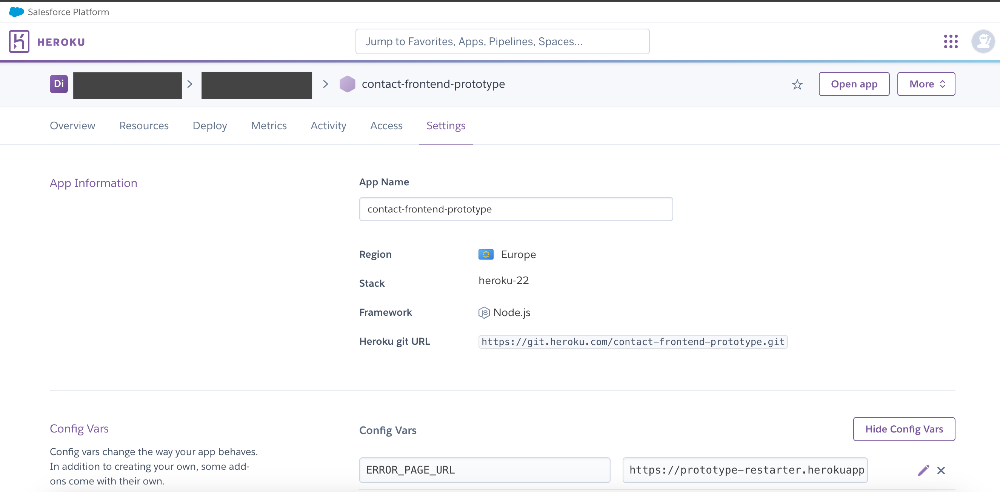

# prototype-restarter

`prototype-restarter` is an application to serve a page that can be used to automatically restart a stopped prototype on 
Heroku. Heroku prototypes can be configured to redirect to `prototype-restarter` if a specific prototype is not running. 
Additionally, there are certain descriptive error messages loaded for other Heroku errors.

`prototype-restarter` is itself a Node.js application that is deployed to Heroku.

## Deployment and linking to specific Heroku prototypes 

Heroku allows for a custom error URL to get set for a prototype. This can be set within the Heroku UI.

**Heroku UI**
```shell
ERROR_PAGE_URL=https://prototype-restarter.herokuapp.com/
```



Given a prototype is stopped, when it is visited, then `prototype-restarter` is loaded to display the error page.
`prototype-restarer` will look up the prototype name from the referrer header and restart it by sending a `PATCH` request
to the Heroku API (with necessary credentials).

After that the user is asked to refresh the page (which we can't do automatically because of restrictions on the iframe
the error page is loaded within).


## Possible Content From `prototype-restarter`

### Restart prototype 
If the current count of dynos for a specified prototype is set to 0, `prototype-restarter` will simply return a page with
a green button stating "Restart prototype" and some accompanying text explaining that the prototype has been stopped.

### Prototype not deployed
If there is no matching prototype name for a prototype that has been deployed to Heroku, `prototype-restarter` will 
return a page titled "This prototype is not deployed" to the end user. The end user will **not** see a restart button in 
this scenario.

### Prototype has errors
If the count of dynos for a specified prototype is greater than 0 but an error is still being returned, `prototype-restarter`
will return a page titled "This prototype has errors". For example, if there is a error in the prototype code that 
prevents it from starting correctly. The end user will **not** see a restart button in this scenario.

### 

## Running locally

Assuming you have the heroku cli installed, you will need a [HEROKU_API_TOKEN](https://github.com/hmrc/prototype-restarter/blob/main/src/app.js#L5C48-L5C64) to make calls to Heroku API

The `npm start` script uses the dotenv library to automatically load environment variables from a `.env` file if present 

```
nvm install
heroku login
echo "HEROKU_API_TOKEN=$(heroku auth:token)" > .env
npm install
npm start
```

### Creating an API key for use by `prototype-restarter`

The `prototype-restarter` itself runs on heroku at the moment, so you can manage the `HEROKU_API_TOKEN` environment variable in the settings section of the Heroku control panel.

API keys need `--scope=read,write` access so that we can read if the prototype has dynos at the moment, and if not so we can write a new running dyno to the app formation if the user clicks "restart"

Don't use `heroku auth:token`, [heroku advises only to use them for local development](https://help.heroku.com/PBGP6IDE/how-should-i-generate-an-api-key-that-allows-me-to-use-the-heroku-platform-api), instead use the following command:

```
heroku authorizations:create --description="For hmrc/prototype-restarter" --scope=read,write
```

You'll see output like the following, and the prototype-restarters' `HEROKU_API_TOKEN=` environment variable needs to be set to the value after `Token:`

> **Note**
> the keys below are examples with the same format as a heroku api key, not actual keys

```
Creating OAuth Authorization... done
Client:      <none>
ID:          f81d4fae-7dec-11d0-a765-00a0c91e6bf6
Description: For hmrc/prototype-restarter
Scope:       read,write
Token:       1d6c0810-2bd6-45f3-9890-0268422a6f14
Updated at:  Mon Jul 10 2023 13:55:45 GMT+0100 (British Summer Time) (less than a minute ago)
```

If you don't set an expiry explicitly then the authorization won't expire.

## License

This code is open source software licensed under the [Apache 2.0 License]("http://www.apache.org/licenses/LICENSE-2.0.html").
